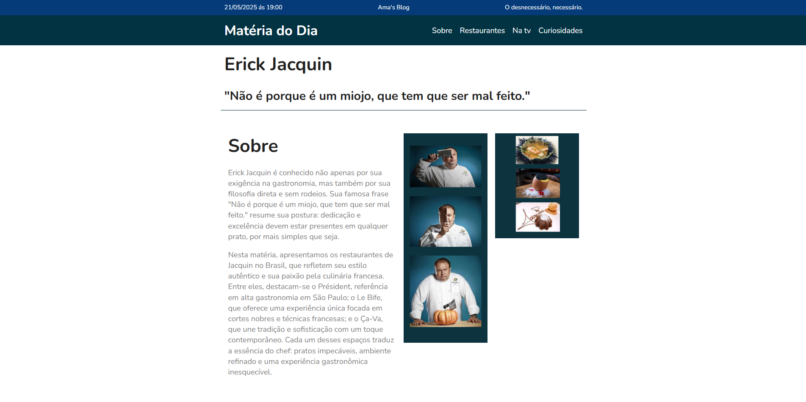
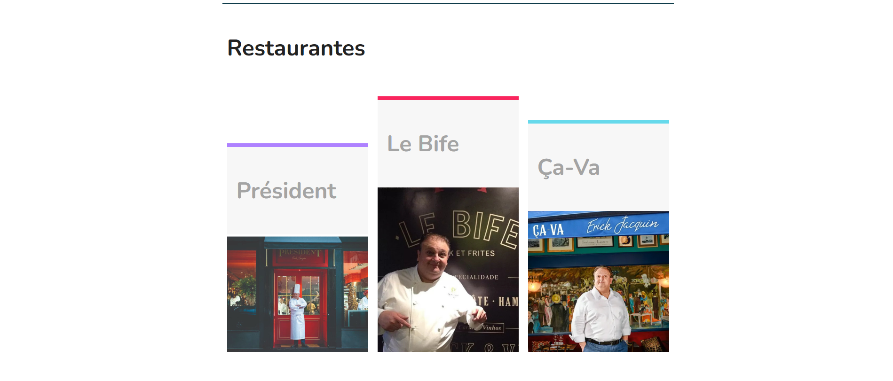
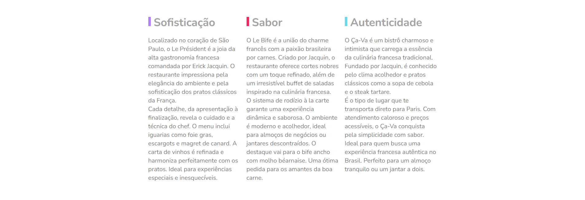
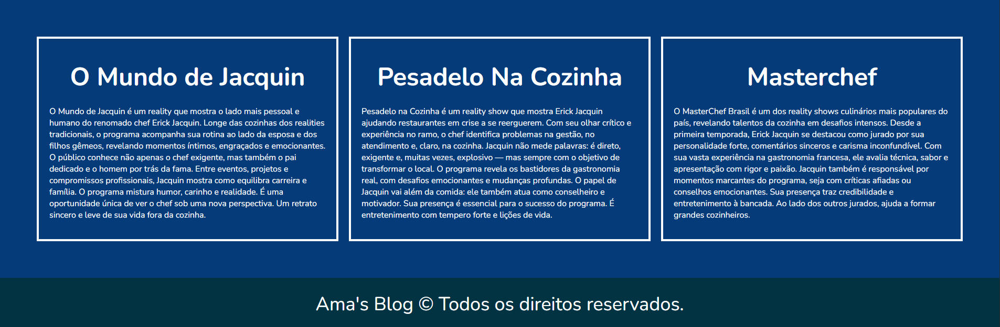

# 🍽️ Le Président - Site Responsivo

Bem-vindo ao repositório do **Le Président**, um projeto de site institucional fictício desenvolvido com foco em boas práticas de **HTML5** e **CSS3**, com layout responsivo, sem o uso de frameworks. Inspirado na elegância de um restaurante moderno, o projeto destaca a estrutura limpa, semântica e a estilização utilizando variáveis CSS.

## 📸 Preview

 <!-- Atualize o caminho conforme necessário -->

## 🛠️ Tecnologias utilizadas

- HTML5
- CSS3 (Flexbox + Variáveis)
- Responsividade com media queries
- Tipografia externa com Google Fonts (`Nunito`)

## 📁 Estrutura do Projeto

/
├── index.html
├── style.css
├── /img
│ └── lepresident.png
└── README.md






## 🎨 Paleta de Cores

As cores foram definidas por meio de variáveis CSS no `:root`:

- Azul Escuro: `#122ab2`
- Azul Claro: `#2c70ff`
- Roxo: `#ae81ff`
- Rosa: `#f9265e`
- Azul Claro (linhas): `#66d9eb`
- Cinza Claro: `#a4a4a4`
- Cinza Forte: `#7c7c7c`
- Preto Brilhante: `#222222`
- Cinza de fundo: `#f7f7f7`

## 📱 Responsividade

O layout se adapta a diferentes tamanhos de tela. Há estilizações específicas aplicadas para resoluções menores que 800px, garantindo uma boa experiência mobile.

## ⚙️ Funcionalidades

- Layout totalmente responsivo
- Navegação clara e objetiva
- Estilo visual coeso com foco na experiência do usuário
- Seções: Cabeçalho, Introdução, Sobre, Produtos, Preços, Qualidade e Footer

## 📌 Aprendizados

Este projeto foi fundamental para praticar:

- Uso de variáveis CSS
- Flexbox em estrutura real
- Media queries para design responsivo
- Organização de conteúdo semântico

## 🚀 Como usar

1. Clone o repositório:
   ```bash
   git clone https://github.com/Trinkatdot/Projeto_erick.git
   ```
2. Abra o arquivo index.html em qualquer navegador moderno.

🧑‍💻 Autores
Desenvolvido por Agatha Katherine, Mayara Emanuela e Alisson Silva.
Técnico em Informática pelo SENAC Largo Treze.

💼 LinkedIn https://www.linkedin.com/in/agatha-katherine-trindade-aureliano-b22420245/


✉️ Contato: amasblog@email.com


---


